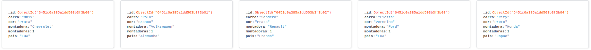

SPRO Case
==============================

    

   
O case trabalhado teve como objetivo testar as habilidades de criação de dataframes, um banco em MongoDB e aggregate em js.

No arquivo create_data.py estabelece a conexão com o banco de dados MongoDB, cria as tabelas abaixo e insere nas collections indicadas conforme orientações na pasta /docs. 

|Carro| Cor | Montadora |     |-----|-------|----------|     | Montadora | País |      
|-----|-------|----------|    |-----|-------|----------|     |-----------|------|
|Onix |Prata | Chevrolet |    |-----|-------|----------|     | Chevrolet | EUA  |
|Polo | Branco | Volkswagen | |-----|-------|----------|     | Volkswagen | Alemanha |
|Sandero | Prata |	Renault | |-----|-------|----------|     | Renault | Franca |
|Fiesta	| Vermelho | Ford |   |-----|-------|----------|     | Ford | EUA |
|City |	Preto |	Honda|        |-----|-------|----------|     | Honda | Japao |

 

| Montadora | País |
|-----------|------|
| Chevrolet | EUA  |
| Volkswagen | Alemanha |
| Renault | Franca |
| Ford | EUA |
| Honda | Japao |

No arquivo aggregate.js executa a agregação dos dados mostrando as informações conforme imagem abaixo:

    

No arquivo sum_countries.js executa a agregação sumarizando a quantidade de veículos/montadora por país, conforme imagem abaixo:

    

As agregações foram testadas no MongoDB Compass.
